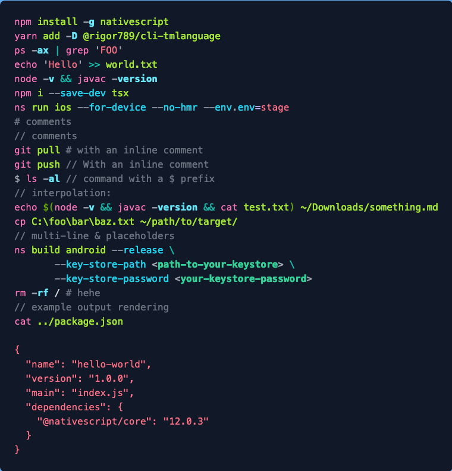

# cli-tmlanguage

A TextMate grammar to highlight CLI commands.

The published files contain the `cli.tmlanguage.json` as well as a sample Shiki theme in `cli.theme.json`.

## Running/building

To build the theme and tmlanguage, run `yarn build`, or `yarn dev` for watch mode.

To preview the theme & language, run `yarn dev` inside the demo folder (and `yarn dev` in root to build the language in watch mode) and then open http://localhost:5173/
